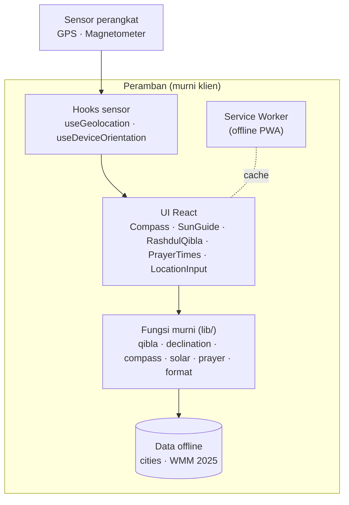
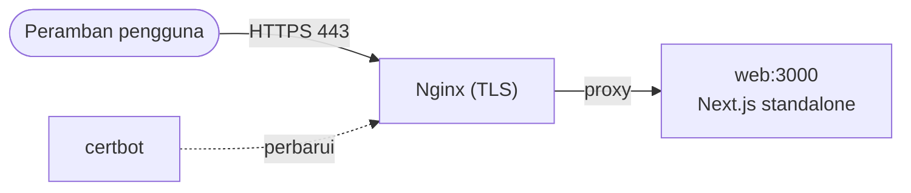

# Arah Kiblat - Ilmu Falak


Aplikasi web (PWA) untuk menentukan **arah kiblat** secara akurat dan **transparan** —
menampilkan metode perhitungan beserta rujukannya, bukan sekadar panah di layar.

Seluruh perhitungan berjalan **sepenuhnya di peramban**: tanpa backend, tanpa database.
Lokasi Anda tidak pernah dikirim ke server (**privasi terjaga**) dan aplikasi dapat
berjalan **offline** setelah dipasang.

## Ringkasan

Kebanyakan aplikasi kiblat hanya menunjukkan panah tanpa menjelaskan dari mana angkanya.
Proyek ini menonjolkan sisi **edukatif**: setiap arah disertai rumus, koordinat Ka'bah
beserta sumbernya, dan penjelasan koreksi yang dipakai. Cocok sebagai alat praktis
sekaligus bahan belajar ilmu falak.

- **Akurat** — azimut lingkaran besar (great-circle) + koreksi deklinasi magnetik.
- **Transparan** — Panel Metode & Rujukan menampilkan rumus dan sumber.
- **Privasi-first** — komputasi 100% di klien; lokasi tak pernah keluar dari perangkat.
- **Offline** — PWA dengan service worker; berjalan tanpa jaringan setelah dipasang.

## Fitur

### Arah kiblat

- Azimut kiblat dengan metode **great-circle** (initial bearing) ke koordinat Ka'bah.
- Jarak ke Ka'bah dan status akurasi lokasi.

### Kompas

- **Kompas real-time** dari sensor perangkat, dengan **koreksi Deklinasi Magnetik**
  (model WMM 2025, offline), heading terkompensasi kemiringan, dan koreksi orientasi
  layar (portrait/landscape).
- **Indikator akurasi kompas** + **kalibrasi terpandu** (ajakan gerak angka 8 saat
  akurasi rendah). Memakai nilai resmi iOS; di Android diperkirakan dari heuristik
  goyangan (jitter) heading.
- Fallback statis bila sensor tak ada atau tidak mengacu Utara Sejati.

### Metode Matahari (tanpa kompas)

- **Arah via Matahari** — posisi Matahari dihitung dari lokasi & waktu (algoritma NOAA)
  sebagai acuan arah lewat bayangan; tidak terpengaruh gangguan magnet.
- **Rashdul Qibla** — hitung mundur ke momen Matahari tepat di atas Ka'bah, saat
  bayangan benda tegak menunjuk lurus menjauhi kiblat (verifikasi tanpa alat).

### Jadwal salat

- **Jadwal salat harian** (Subuh, Terbit, Dzuhur, Ashar, Magrib, Isya) dihitung dari
  posisi Matahari, dengan pilihan **metode** (Kemenag RI, MWL, ISNA, Umm al-Qura,
  Mesir), **madzhab Ashar** (Standar/Hanafi), dan **ihtiyat per waktu** (menit pengaman
  tiap salat).
- **Widget salat berikutnya** dengan hitung mundur (otomatis ke Subuh besok bila sudah
  lewat Isya).
- **Tanggal Hijriah** hari ini (kalender Umm al-Qura).

### Tampilan

- Tema **terang / gelap / ikuti sistem** yang bisa dipilih (disimpan di `localStorage`).

### Lokasi & PWA

- **GPS otomatis** atau **fallback manual** (cari kota offline / input koordinat),
  preferensi disimpan di `localStorage`.
- **PWA** installable dengan service worker offline-first dan ikon lengkap (maskable).

## Cara Kerja & Metode

Nilai inti aplikasi ada di transparansi metode. Semua ini juga ditampilkan di dalam
aplikasi pada **Panel Metode & Rujukan**.

### Azimut kiblat (great-circle)

Azimut awal lingkaran besar dari lokasi pengguna ke Ka'bah, diukur searah jarum jam
dari Utara Sejati:

```Azimut kiblat
θ = atan2( sin Δλ · cos φ₂,  cos φ₁ · sin φ₂ − sin φ₁ · cos φ₂ · cos Δλ )
```

dengan φ₁, λ₁ = lokasi pengguna; φ₂, λ₂ = Ka'bah; Δλ = λ₂ − λ₁.

### Koordinat Ka'bah

21.4225° LU, 39.8262° BT (Masjidil Haram, Makkah).

### Deklinasi Magnetik

Kompas menunjuk Utara Magnet, sedangkan azimut kiblat mengacu Utara Sejati. Selisihnya
dikoreksi memakai model **WMM (World Magnetic Model) 2025**, dihitung offline di peramban
via paket [`geomagnetism`](https://github.com/naturalatlas/geomagnetism).

### Posisi Matahari & Rashdul Qibla

Azimut, ketinggian, dan deklinasi Matahari dihitung dengan **algoritma NOAA** dari lokasi
dan waktu. Ini menjadi dasar metode bayangan dan pencarian momen **Rashdul Qibla**
(saat sub-titik Matahari melewati Ka'bah, ± dua kali setahun).

### Perhitungan jadwal salat

Waktu salat dihitung dari sudut ketinggian Matahari untuk tanggal & lokasi (berbagi
perhitungan `solarCoords` dengan metode di atas):

- **Subuh & Isya** — sudut depresi Matahari sesuai metode (mis. Kemenag RI 20°/18°;
  Umm al-Qura memakai interval 90 menit setelah Magrib untuk Isya).
- **Ashar** — dari faktor bayangan (Standar/Syafi'i = 1, Hanafi = 2).
- **Ihtiyat** — menit pengaman opsional **per waktu** (tiap salat bisa berbeda; default
  gaya Kemenag +2 menit, Terbit −2 menit), berguna agar cocok dengan jadwal resmi. Waktu
  ditampilkan menurut zona waktu perangkat.

Keputusan desain dirangkum di [`docs/plan.md`](docs/plan.md) dan ADR di
[`docs/adr/`](docs/adr/); glosarium istilah di [`docs/CONTEXT.md`](docs/CONTEXT.md).

## Arsitektur

Aplikasi murni klien: UI memanggil hooks sensor dan fungsi murni, tanpa backend.



### Struktur

```Struktur
app/          Halaman, layout, manifest, service worker (Serwist)
components/    Compass, LocationInput, MethodPanel, SunGuide, RashdulQibla, PrayerTimes, CompassAccuracy, QiblaClient
hooks/         useGeolocation, useDeviceOrientation
lib/           Fungsi murni: qibla, declination, compass, format, solar, prayer, storage, constants
data/          cities.ts (dataset kota offline)
public/        Ikon PWA (icon.svg + PNG) dan aset statis
docs/          plan.md, CONTEXT.md (glosarium), adr/
```

- **Logika inti = fungsi murni** di [`lib/`](lib/) (mudah diuji, TDD): `qiblaAzimuth`,
  `haversineDistance`, `magneticDeclination`, `compassRotation`, `formatBearing`,
  `solarPosition`, `nextRashdulQibla`, `prayerTimes`.
- **Sensor via hooks** memisahkan efek/izin dari logika perhitungan.
- **UI** mengonsumsi hooks + fungsi murni; `QiblaClient` menjadi penghubungnya.

## Menjalankan Secara Lokal

Prasyarat: Node.js 20.9+ (diuji pada Node 22) dan npm.

```bash
npm install
npm run dev      # http://localhost:3000 (Turbopack)
```

> Kompas & GPS butuh konteks aman: `localhost` sudah cukup untuk pengembangan;
> di produksi wajib HTTPS (lihat [Deployment](#deployment-vps)).

## Skrip npm

| Skrip                    | Fungsi                                                |
| ------------------------ | ----------------------------------------------------- |
| `npm run dev`            | Server pengembangan (Turbopack)                       |
| `npm test`               | Unit & component test (Vitest)                        |
| `npm run lint`           | ESLint                                                |
| `npm run build`          | Build produksi (webpack, menghasilkan service worker) |
| `npm run generate-icons` | Buat ulang ikon PWA dari `public/icon.svg`            |

> **Catatan build:** memakai **webpack** (`next build --webpack`) karena `@serwist/next`
> belum mendukung Turbopack. Service worker hanya dihasilkan saat build produksi. Karena
> `output: "standalone"`, preview produksi lokal dijalankan dengan `npm run build` lalu
> `node .next/standalone/server.js`.

## Deployment (VPS)

Sensor `DeviceOrientation` dan Geolocation **membutuhkan HTTPS**. Stack Docker sudah
menyertakan **Nginx** (reverse proxy TLS) dan **certbot** (Let's Encrypt otomatis).

```bash
cp .env.example .env          # isi DOMAIN & CERTBOT_EMAIL
docker compose build
chmod +x init-letsencrypt.sh
./init-letsencrypt.sh         # sertifikat pertama (uji: STAGING=1 ./init-letsencrypt.sh)
docker compose up -d          # jalankan web + nginx + certbot
```



Prasyarat: DNS domain mengarah ke IP VPS dan port 80/443 terbuka. certbot memperpanjang
sertifikat otomatis; Nginx memuat ulang berkala tanpa downtime.

> `.env` hanya berisi `DOMAIN` dan email untuk penyiapan TLS (Nginx/certbot). Aplikasi
> sendiri tetap murni klien — tanpa variabel rahasia atau data yang dikumpulkan server.

## Keamanan & Privasi

- **Tanpa server/basis data** — tak ada endpoint, kredensial, atau data yang disimpan
  di sisi server. `localStorage` hanya menyimpan koordinat non-sensitif.
- **Header keamanan** disetel di [`next.config.ts`](next.config.ts): `Content-Security-Policy`,
  `Strict-Transport-Security`, `X-Frame-Options`, `X-Content-Type-Options`,
  `Referrer-Policy`, dan `Permissions-Policy` yang membatasi sensor ke origin sendiri.
- **Dependensi produksi**: `npm audit` bersih (0 kerentanan).

## Pengujian

83 test (Vitest + Testing Library) mencakup:

- **Fungsi murni** `lib/` — azimut kiblat divalidasi terhadap nilai terpublikasi
  (Jakarta, New York, London, Istanbul), posisi Matahari terhadap momen Rashdul Qibla,
  jadwal salat (urutan, simetri terbit/terbenam, metode & madzhab, ihtiyat), instruksi
  belok, serta level akurasi kompas (nilai iOS & heuristik jitter).
- **Hooks** — `useGeolocation` (izin, fallback, pembersihan watcher) dan
  `useDeviceOrientation` (heading absolut vs relatif, akurasi & estimasi jitter).
- **Komponen** — `LocationInput` (pencarian kota, validasi koordinat), `Compass`, dan
  `CompassAccuracy` (badge & panduan kalibrasi).

```bash
npm test
```

## Batasan & Rencana Lanjutan

MVP fokus pada arah kiblat, kini juga mencakup jadwal salat. Rencana lanjutan: model
ellipsoid (Vincenty), multi-bahasa (ID/EN/AR), overlay AR kamera, aplikasi native, serta
modul ilmu falak lain (kalender hijriah, rukyat hilal). Lihat [`docs/plan.md`](docs/plan.md).

Akurasi kompas bergantung pada sensor dan kalibrasi perangkat — jauhkan dari benda
logam/magnet dan kalibrasi dengan gerakan angka 8. Bila sensor tak andal, gunakan
**Arah via Matahari**.

## Kontribusi

Kontribusi dipersilakan.

1. Fork dan buat branch fitur.
2. Jaga agar `npm test` dan `npm run lint` hijau; tambahkan test untuk logika baru
   (utamakan fungsi murni di `lib/` dengan pendekatan TDD).
3. Ajukan pull request dengan deskripsi ringkas beserta alasannya.

## Lisensi

Dirilis di bawah lisensi [MIT](LICENSE) © riskyakbar15.
